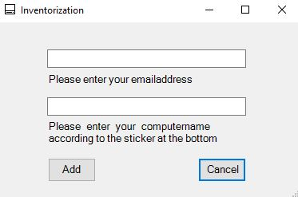
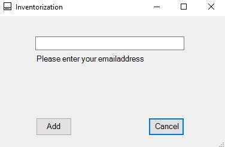

## Windows client

Just define the parameters by following the examples in inventory.ps1
```
$apiKey = ''
$baseUrl = ""
$fsField = ""
$cpuField = ""
$ramField = ""
$macField = ""
$diskField = ""
$osField = ""
$statusID = ""
```
and leave everything else as it is. 
If you want your users to type in the asset tag manually, change `$getTag=0` to `$getTag=0`.
If you want to disable the GUI, change `$enableGUI=1` to `$enableGUI=2` (This will only inventorize the asset without a user)

Then save everything and zip the folder and send it out to your users.

After running the batch-file, your users will see this, if you enabled manual setting of the asset-name:


And this, if you disabled it:



