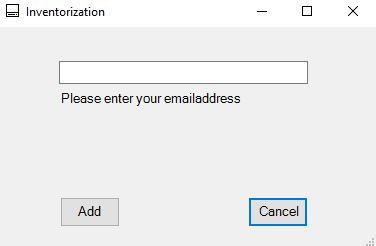

# Snipe-IT Rest Api Clients

## What is this and why?
This project serves as inventorization clients for Snipe-IT. It was created out of lazyness and "cost efficiency" (read: stingyness), as I didn't want to manually inventorize the assets we already had and I was not willing to pay for intunes or a similar solution, so this was the most reasonable approach. The user only needs administrative rights on his/her
computer and can run everything.

## Getting Started

You´ll obviously need a working Snipe-IT installation and an API key. 
This will not be in the scope of this document, but there are some great tutorials
on how to get [Snipe-IT running in Docker](https://snipe-it.readme.io/docs/docker) and create an API key.

### Prerequisites

The Windows client is pure powershell and uses forms (with a Base64 encoded Icon).
You don't need to add any modules, as it uses only existing Powershell commands. The only drawback is
an out of the box restricted execution policy, when it comes to downloaded powershell-scripts.
That's why I added the helper.bat, which will just call an elevated powershell.

For the OSX client, it is strongly advised to use [Pashua](https://github.com/BlueM/Pashua) - great work of @BlueM -
and [Playtpus](https://github.com/sveinbjornt/Platypus) - great work of @sveinbjornt -  to create an app out of the code.
You can run the whole thing as a script, but won't present the more or less neat UI.


## Preparing Snipe-IT and the Clients

### Snipe-IT

You'll need to create some fieldsets in Snipe-IT for these clients to work properly. For a proper inventorization I choose the CPU, Disksize, Ramsize, Primary Macaddress and the OS.
These fields need to be added to the client-scripts, as they aren't standartized. The names of the fields need to be pulled from Snipe-IT => Custom Fields => DB Field and then inserted into the clients.


Afterwards you'll need to get the ID of the fieldset you want to assign to your assets. (You can find it by going to your custom fieldsets => open the fieldset itself=>last number of the URL is the fieldset ID).


Last but not least, you'll need to get the status-id of the status you want to have after the device is checked out. This can be found under Status Labels => edit the status label => last number of the URL is the status-ID).


### Windows client

Just define the parameters by following the examples in inventory.ps1
```
$apiKey = ''
$baseUrl = ""
$fsField = ""
$cpuField = ""
$ramField = ""
$macField = ""
$diskField = ""
$osField = ""
$statusID = ""
```
and leave everything else as it is. 
If you want your users to type in the asset tag manually, change `$getTag=0` to `$getTag=0`.
If you want to disable the GUI, change `$enableGUI=1` to `$enableGUI=2` (This will only inventorize the asset without a user)

Then save everything and zip the folder and send it out to your users.

After running the batch-file, your users will see this, if you enabled manual setting of the asset-name:


And this, if you disabled it:



### OSX client

On a Mac: Download [Platypus](https://github.com/sveinbjornt/Platypus) and [Pashua](https://github.com/BlueM/Pashua). Download osx-script.sh and pashua.sh.
Define the parameters by following the examples in osx-script.sh.
```
apiKey = ''
baseUrl = ""
fsField = ""
cpuField = ""
ramField = ""
macField = ""
diskField = ""
osField = ""
statusID = ""
```
and leave everything else as it is. 
If you want your users to type in the asset tag manually, change `getTag="1"` to `getTag="0"`.
If you want to disable the GUI, change `enableGUI="0"` to `enableGUI="1"` (This will only inventorize the asset without a user)

Now open Platypus and add the script to your new program.

## Deployment

The Windows client should include the helper.bat to bypass the execution-policy, as most Windows installations will have a restricted execution policy. Just zip both files into a folder
and let the users unzip it to the desktop and run helper.bat. They'll get a prompt for insecure software. This can be bypassed by adding a valid certificate, which was beyond the scope of this project.

The OSX client 

## Some notes on the code

The code is far from perfect or optimized, but should serve as an inspiration for people who want to try out Snipe-IT or just want to do their inventorization and don't have the necessary environment.

## Security

Please be aware, that your Snipe-IT API Key will be readable. Either work with a very restricted acocunt that can create Models,Assets, Categories etc and check assets out or make sure that the file is encrypted (not in the scope of this project)

## Built With

* [Visual Studio Code](https://code.visualstudio.com/) 
* [Snipe-IT](https://snipeitapp.com/)
* [Platypus](https://github.com/sveinbjornt/Platypus)
* [Pashua](https://github.com/BlueM/Pashua)

## License
BSD 3-Clause License

Copyright (c) 2020, Christian Gaetcke <cgaetcke@outlook.com>.
All rights reserved.

Redistribution and use in source and binary forms, with or without
modification, are permitted provided that the following conditions are met:

* Redistributions of source code must retain the above copyright notice, this
  list of conditions and the following disclaimer.

* Redistributions in binary form must reproduce the above copyright notice,
  this list of conditions and the following disclaimer in the documentation
  and/or other materials provided with the distribution.

* Neither the name of the copyright holder nor the names of its
  contributors may be used to endorse or promote products derived from
  this software without specific prior written permission.

THIS SOFTWARE IS PROVIDED BY THE COPYRIGHT HOLDERS AND CONTRIBUTORS "AS IS"
AND ANY EXPRESS OR IMPLIED WARRANTIES, INCLUDING, BUT NOT LIMITED TO, THE
IMPLIED WARRANTIES OF MERCHANTABILITY AND FITNESS FOR A PARTICULAR PURPOSE ARE
DISCLAIMED. IN NO EVENT SHALL THE COPYRIGHT HOLDER OR CONTRIBUTORS BE LIABLE
FOR ANY DIRECT, INDIRECT, INCIDENTAL, SPECIAL, EXEMPLARY, OR CONSEQUENTIAL
DAMAGES (INCLUDING, BUT NOT LIMITED TO, PROCUREMENT OF SUBSTITUTE GOODS OR
SERVICES; LOSS OF USE, DATA, OR PROFITS; OR BUSINESS INTERRUPTION) HOWEVER
CAUSED AND ON ANY THEORY OF LIABILITY, WHETHER IN CONTRACT, STRICT LIABILITY,
OR TORT (INCLUDING NEGLIGENCE OR OTHERWISE) ARISING IN ANY WAY OUT OF THE USE
OF THIS SOFTWARE, EVEN IF ADVISED OF THE POSSIBILITY OF SUCH DAMAGE.

## Acknowledgments

* Marco Blüm for Pashua
* Sveinbjorn Thordarson for Platypus
* Adam Bacon for the chassis-type code
